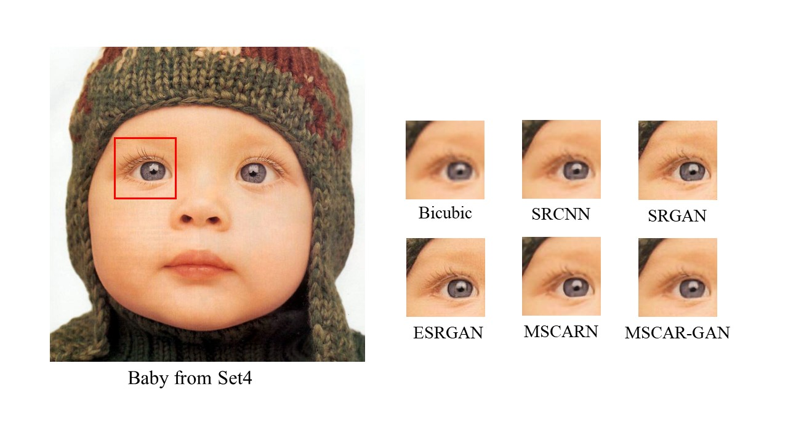
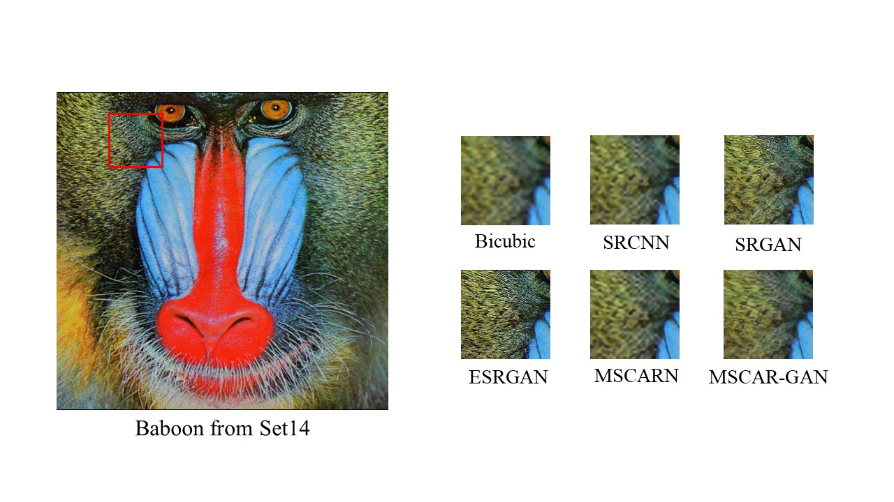
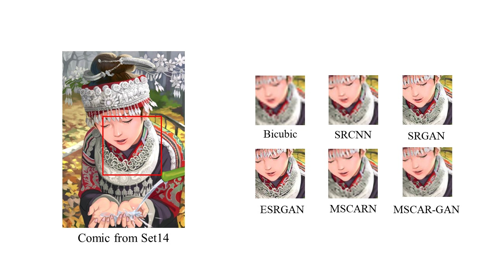

# MSRN-RCAN-SRGAN

## Overview
This repository contains an simple PyTorch implementation of [SRGAN](https://arxiv.org/abs/1609.04802) combined with
    [EDSR](https://arxiv.org/abs/1707.02921),
    [RCAN](https://arxiv.org/abs/1807.02758), 
    [MSRN](https://arxiv.org/abs/1904.10698)

Now CPU/OneGPU version has been implemented, you can use it freely with bash, the codes are in folder: MyNet 
  
As for DDP version, the codes is also available in folder: MyNet_ddp but may not be easy to use, and it will coming soon 
  

## Prerequisites
1. Linux version 3.10.0-693.el7.x86_64
2. Python 3.8.15
3. Pytorch 1.12.0
4. CUDA Toolkit 11.6
5. cuDNN 8302

## Download Weights
Pretrained weight for CNN and GAN also offer [Google Drive](https://drive.google.com/drive/folders/1SM0gsugcjTfYDlYrIqyWXFZyYuA6LkXc?usp=sharing)

## How to train
1. prepare the dataset  [DIV2K](https://data.vision.ee.ethz.ch/cvl/DIV2K/) in whatever directory you want, and assign to args in train.py/pretrain.sh
2. assign the model out path as above too
3. input: bash pretrain.sh 
4. if you want to monitor the training, input: bash tensorboard.sh after you assign the model out paht in bash

## How to test
1. use test.ipynb in MyNet.code, the example has been offered

## Dateset Settings:
1. The function torchvision.transforms.Resize used for downsample is not bicubic by default, but has been change to Bicubic now
2. Training and Validating Dateset is  [DIV2K](https://data.vision.ee.ethz.ch/cvl/DIV2K/)
3. Data augmentation: random crop -> random rotation in 90 * k degree/flipping, you can change it in MyNet.code.dataset.py

## Train Settings:
1. You can assgin your own lr_scheduler in net.solver.__init__
2. D_train require d_real_loss and d_fake_loss more than 0.4 to aviod D too strong, you can change the value in train.py's D_threshold !!!
3. Hyper parameter K in GAN is not supported(default==1) because it is useless in practice, you have to recode net.solver.run/run_resume if you want
4. pretrain G with 1e-4 lr for 2000 times, and then 1e-5 lr for 8000 times
5. run G and D G with 1e-5 lr for 10000 times
6. the more iteration you train in pretrain and run, the better G is, if you want know more, read about [SRGAN](https://arxiv.org/abs/1609.04802) or [ESRGAN](https://arxiv.org/abs/1809.00219)

## Test Settings:
1. PSNR and SSIM calculations are only on the y channel
2. Use float32 for PSNR calculation and uint8 for SSIM calculation

## Performance in PSNR/SSIM
|  Model   | Set5  | Set14   | BSD100 |
|  ----  | ----  |  ----  | ----  |
| Bicubic |	28.42/0.8223 | 25.95/0.7246 | 25.97/0.6862 |
| SRCNN | 30.07/0.8627 | 27.18/0.7861 |	26.68/0.7291 |
| SRGAN | 29.40/0.8472 | 26.02/0.7397 |	25.16/0.6688 |
| ESRGAN | 30.39/0.8641 | 26.20/0.7211 | 25.35/0.6732 |
| MSCARN(Ours) | 32.00/0.9019 |	28.36/0.8003 | 27.59/0.7550 |
| MSCAR-GAN(Ours) |31.13/0.8803 | 27.74/0.7691 | 27.04/0.7199 |

## Result

